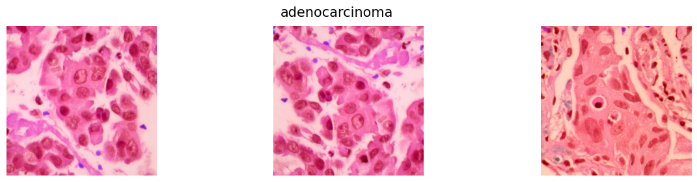
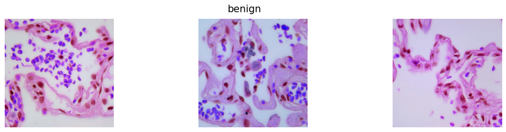
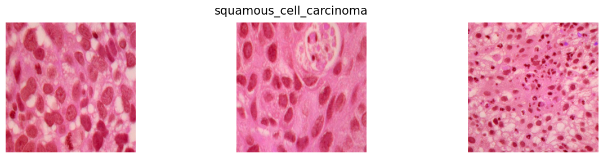

#  Lung Cancer Histopathology Image Classification using Deep Learning

This repository contains a Jupyter Notebook that implements a deep learning solution for classifying lung cancer from histopathology images. The objective is to automatically distinguish between **adenocarcinoma**, **squamous cell carcinoma**, and **benign** tissue types using Convolutional Neural Networks (CNNs) and transfer learning.

---

- ## Introduction

Lung cancer is one of the leading causes of cancer-related deaths globally. Accurate and early diagnosis plays a vital role in improving patient survival rates. This project automates the classification of lung cancer histopathology images to assist pathologists in identifying:

- Adenocarcinoma  
- Squamous Cell Carcinoma  
- Benign tissues

The model uses transfer learning with **VGG16**, a well-established deep learning architecture trained on ImageNet, to boost performance and generalization.
 --- 
- ## Dataset
-  `adenocarcinoma`  
- `benign`  
- `squamous_cell_carcinoma`
<p align="left">
  
 
 
</p>

The dataset used in this project is publicly available on Kaggle:  
🔗 [Lung Cancer Histopathological Images Dataset](https://www.kaggle.com/datasets/rm1000/lung-cancer-histopathological-images)

Images are resized to `224x224` pixels.
---

##  Methodology

The pipeline involves the following stages:

1. **Data Loading & Preprocessing**  
   - Resize and grayscale images  
   - Apply `ImageDataGenerator` for data augmentation

2. **Transfer Learning with VGG16**  
   - Use VGG16 without top layers  
   - Freeze convolutional layers  
   - Add custom dense layers for classification

3. **Model Compilation & Training**  
   - Optimizer: `Adam`  
   - Loss Function: `categorical_crossentropy`  
   - Metrics: `accuracy`

---
##  Model Architecture

The model is based on **VGG16** as a feature extractor:
- **GlobalAveragePooling2D**: Reduces spatial dimensions
- **Dense Layers**: Fully connected layers for classification
- **Dropout**: Reduces overfitting
- **Softmax**: Outputs probabilities for the three classes

---

##  Training

- Training is done using the prepared augmented dataset
- Epochs and batch size are configurable
- Model checkpoints and early stopping can be added for better training control

---

##  Results

After training, the model's performance is visualized and evaluated using:

-  **Confusion Matrix**
-  **Accuracy Score : 97%**
-  **ROC and AUC Curve**


> **Sample Visualizations:** *(Generated after running the notebook)*
> - Training vs Validation Accuracy/Loss Curves
 <p align="center">
  
</p>
> - Confusion Matrix
> - <p align="center">
  
</p>
> - ROC-AUC Curve
-> - <p align="center">
  
</p>

---

##  Dependencies

Ensure the following Python libraries are installed:

```bash
os  
numpy  
pandas  
matplotlib  
opencv-python  
tensorflow  
keras  
scikit-learn  
seaborn
```
---
##  How to Run

Follow these steps to run the project locally or on a cloud platform like Kaggle, Colab, or Jupyter:

### 1️ Clone the Repository (if running locally)

```bash
git clone https://github.com/your-username/lung-cancer-classification.git
cd lung-cancer-classification
```
---
##  Contact

For any inquiries, collaborations, or suggestions, feel free to reach out:

**Md Zunayed**  
📧 Email: md.zunayed02@gmail.com  
🔗 GitHub: [@mdzunayed](https://github.com/mdzunayed)  
🌐 Portfolio: [mdzunayed](https://mdzunayed.github.io/portfolio/)  
📄 LinkedIn: [linkedin.com/in/mdzunayed](https://www.linkedin.com/in/mdzunayed002/)


---

Thank you for checking out this project! If you found it useful, feel free to ⭐ star the repository.

